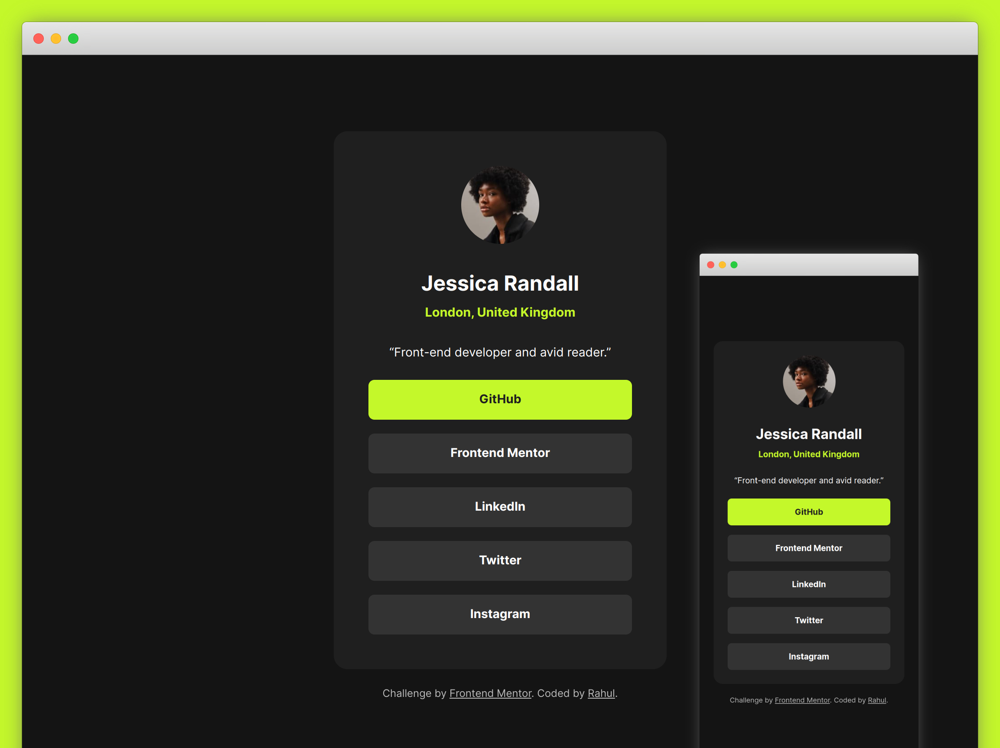

# Frontend Mentor - Social links profile solution

This is a solution to the [Social links profile challenge on Frontend Mentor](https://www.frontendmentor.io/challenges/social-links-profile-UG32l9m6dQ). Frontend Mentor challenges help you improve your coding skills by building realistic projects. 

## Overview

### The challenge

Users should be able to:

- See hover and focus states for all interactive elements on the page

### Screenshot

### Links

- [Solution on FrontendMentor](https://your-solution-url.com)
- [Live Demo on Vercel](https://your-live-site-url.com)

## My process

### Built with

- Semantic HTML5 markup
- CSS custom properties
- Mobile-first workflow (Progressive enhancement)
- Figma to get an idea of spacing and sizing 

### What I learned

I applied my previous knowledge of laying things out and managing customizable settings with custom properties. Keeping the final UI pixel-perfect to the design is always a new learning experience, and as usual, 

I avoided using arbitrary magic numbers to adjust spacing and sizing. Instead, I opted for generally-used values and utilized line-height to address certain spacing issues effectively.

_I noticed the recommended font size of 14px wasn't necessary to achieve the desired UI. The standard 16px base font size worked well, and the basic copy inherited it seamlessly._

## Author

- [github / c99rahul](https://github.com/c99rahul)
- [FrontendMentor / yourusername](https://www.frontendmentor.io/profile/c99rahul)
- [Twitter / @yourusername](https://www.twitter.com/c99rahul)